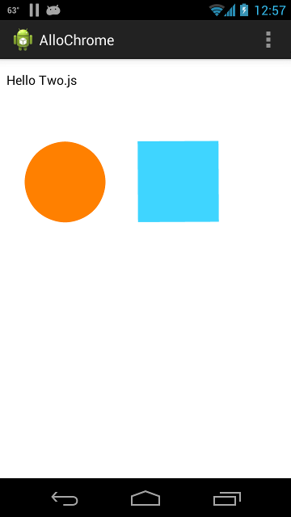

# AlloChrome

This is a test of [ChromeView](https://github.com/pwnall/chromeview), an embedded version of Chromium.

The app tests how well/if this embedded Chrome can render simple web pages using [two.js](http://jonobr1.github.io/two.js/), 
[three.js](http://threejs.org/), and [pixi](https://github.com/GoodBoyDigital/pixi.js). 

At some point it may be possible to test webGL.

Not much works yet, but it is possible to demonstrate using [two.js](http://jonobr1.github.io/two.js/) to render 
and animate some boxes. You can also test how some external websites - google and CNN - render. 

Sample html pages are in assets/www. You can also change pages using the settings prefs. 

